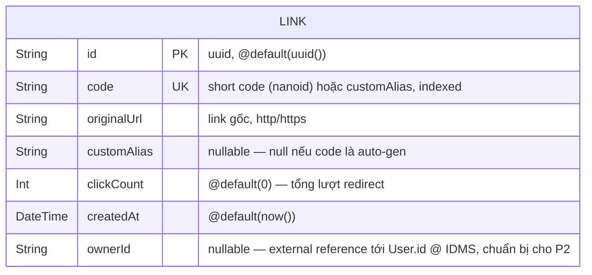

# ERD — web-app-shorten-link

> Schema PostgreSQL (Prisma) cho **`web-app-shorten-link`**. Source-of-truth: file này (sync **TAY** với `server/prisma/schema.prisma`).
> Render: GitHub native, hoặc VS Code extension `bierner.markdown-mermaid`.
> Phạm vi hiện tại (P1): chỉ model `Link`. Chưa có bảng `User` — ownership thực tế (`ownerId`) sẽ được resolve qua IDMS (`web-app-store`) ở P2 (xem [External reference pattern](#external-reference-pattern-ownerid--p2)).

## Module groups

| Module | Tables |
|---|---|
| Link management | `links` |

## Schema

> Chỉ 1 entity ở P1 — không có quan hệ FK trong DB này. `ownerId` là **external reference** (xem ghi chú bên dưới), không có ràng buộc FK vì IDMS là service/DB riêng.

## Field detail

| Field | Kiểu (Prisma) | Constraint | Ghi chú |
|---|---|---|---|
| `id` | `String @id @default(uuid())` | PK | uuid (có thể đổi sang `cuid()` nếu cần thứ tự sort tốt hơn — quyết định ở implementation, không đổi ngữ nghĩa ERD). |
| `code` | `String @unique` | UK, indexed | Short code — hoặc do `nanoid` sinh tự động, hoặc chính là `customAlias` đã được validate + check trùng. Đây là khoá lookup chính cho `GET /:code` (redirect) — **phải** có index unique để redirect nhanh. |
| `originalUrl` | `String` | required | Link gốc, đã validate `http`/`https` ở tầng application (không phải DB constraint). |
| `customAlias` | `String?` | nullable | `null` nếu `code` là auto-gen (`nanoid`); có giá trị (= `code`) nếu user tự chọn alias. Tách field này khỏi `code` để phân biệt "link do hệ thống sinh" vs "link do user đặt tên" (phục vụ thống kê/UX sau này), dù giá trị runtime trùng `code`. |
| `clickCount` | `Int @default(0)` | required | Tăng mỗi lần `GET /:code` redirect thành công (302). Không breakdown geo/device (đó là P3 — cần bảng riêng, ví dụ `link_clicks`, khi tới lúc). |
| `createdAt` | `DateTime @default(now())` | required | Immutable — không có `updatedAt` ở P1 vì record không bị sửa (chỉ `clickCount` tăng — cân nhắc thêm `updatedAt` nếu P3 cho phép sửa `originalUrl`). |
| `ownerId` | `String?` | nullable | **Chuẩn bị cho P2** — gắn user khi đã login qua IDMS. Luôn `null` ở P1 (không có auth). Không phải FK trong DB (xem ghi chú external reference). |

## Index chính

- `@@unique([code])` — bắt buộc, dùng cho lookup redirect nhanh (`GET /:code`) và check-trùng khi tạo (`POST /api/links`).
- (P2, chưa thêm ở P1) `@@index([ownerId])` — khi có truy vấn "list link của tôi" theo `ownerId`, thêm index này lúc implement P2 (ghi nhận ở đây trước để không quên khi viết migration).

## Notes (semantics ngoài schema)

### `code` vs `customAlias`
- Khi user **không** truyền `customAlias`: BE sinh `code` bằng `nanoid` (độ dài/charset cụ thể — xem `project-goals.md` §9 Open Questions), `customAlias = null`.
- Khi user **có** truyền `customAlias`: BE validate format (độ dài, charset cho phép, không trùng reserved keyword) + check `@@unique([code])` chưa tồn tại → nếu hợp lệ, `code = customAlias` và lưu luôn vào `customAlias`. Trùng → `409 Conflict` (không tự động fallback sang code khác).
- Vì `code` là unique toàn cục, auto-gen và custom-alias **dùng chung 1 namespace** — không thể trùng nhau dù nguồn gốc khác nhau.

### `clickCount` — đếm tổng, không phải log chi tiết
- P1 chỉ tăng 1 counter nguyên tử mỗi lần redirect. **Không** lưu từng lượt click riêng lẻ (không có bảng `link_clicks`).
- P3 khi cần breakdown geo/device/referrer sẽ cần thêm bảng con (vd `link_clicks { id, linkId FK, ip, country, deviceType, referrer, createdAt }`) — đây là mở rộng, không phá vỡ field `clickCount` hiện tại (vẫn giữ làm tổng nhanh, tránh `COUNT(*)` mỗi lần hiển thị).

### External reference pattern (`ownerId` — P2)
- `web-app-shorten-link` KHÔNG share database với IDMS (`web-app-store`).
- Khi P2 implement OAuth login, `ownerId` sẽ lưu `User.id` (dạng string, ví dụ uuid) trỏ về user bên IDMS như một **external reference** — không có FK constraint DB-level, không thể `JOIN` trực tiếp.
- Lookup profile chủ link (nếu cần hiển thị) sẽ gọi API của IDMS (`GET /users/:id` hoặc `/oauth/userinfo` với access token), tương tự pattern satellite app đã áp dụng ở `web-app-store-server-client` (`docs/erd.md` §External reference pattern của project đó).

### Soft-delete — không có ở P1
- P1 không hỗ trợ xoá link ở server (Non-Goal — xem `project-goals.md` §5). Không có field `deletedAt`.
- "Xoá" ở P1 chỉ là xoá khỏi **local history** (client-side, localStorage) — record `Link` trong DB vẫn tồn tại, `GET /:code` vẫn redirect bình thường.
- P3 khi cho phép user xoá link thật (server-side) sẽ cần quyết định hard-delete vs soft-delete (`deletedAt`) — ghi nhận làm Open Question tương lai, chưa quyết ở đây.

## How to update

Khi sửa Prisma schema trong `server/prisma/schema.prisma`:
1. Tìm model tương ứng trong ERD này (`LINK`).
2. Sửa field block (type/constraint/comment) trong cả bảng [Field detail](#field-detail) lẫn block `mermaid`.
3. Nếu thêm bảng mới (vd `link_clicks` ở P3) → thêm entity + quan hệ vào diagram, cập nhật [Module groups](#module-groups).
4. Commit cùng PR sửa schema (KHÔNG để drift — nếu code mới hơn ERD, cập nhật ERD trong cùng commit; nếu ERD đi trước code (spec chưa implement), flag rõ trong `writing-plans`).
